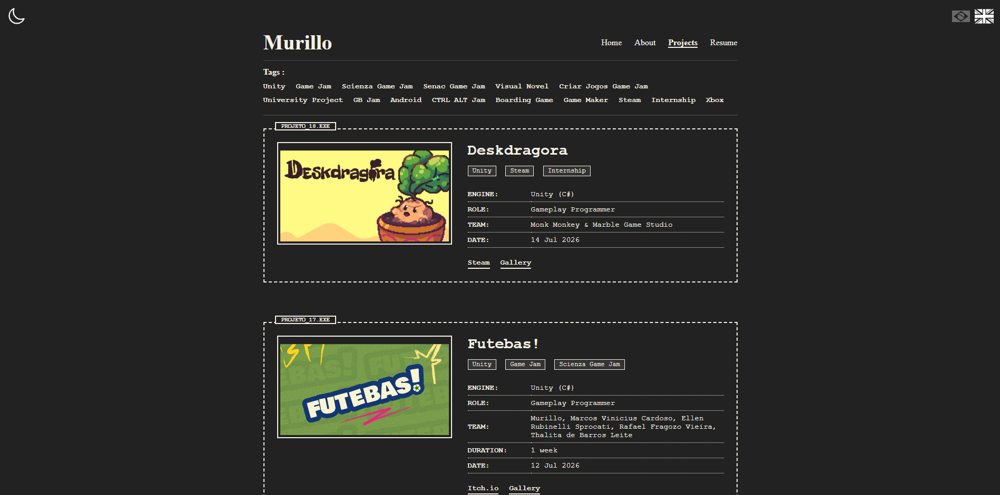
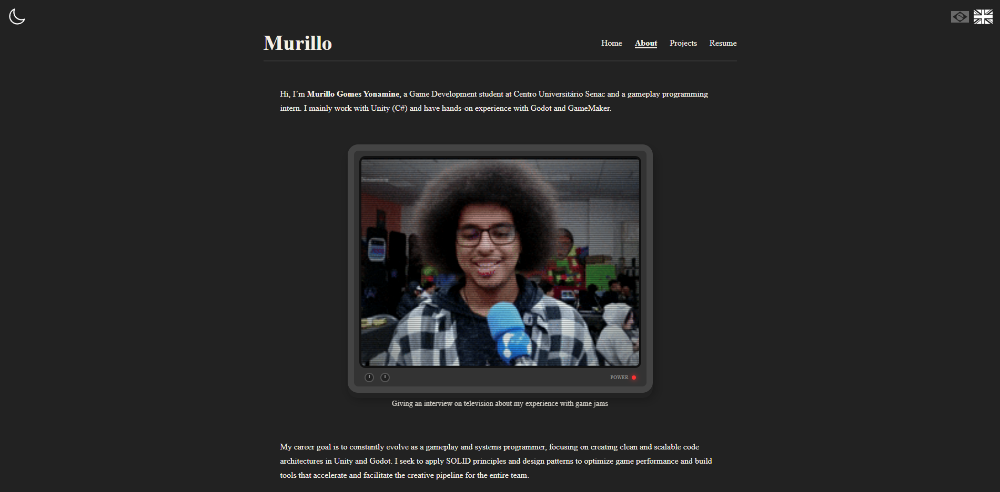
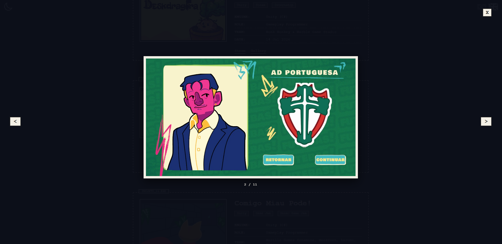

[![Contributors][contributors-shield]][contributors-url]
[![License][license-shield]][license-url]
[![LinkedIn][linkedin-shield]][linkedin-url]
[![Jekyll][Jekyll-badge]][Jekyll-url]
[![HTML5][HTML-badge]][HTML-url]
[![CSS3][CSS-badge]][CSS-url]
[![JavaScript][JS-badge]][JS-url]

<h3 align="center">Murillo Yonamine — Personal Portfolio</h3>

Personal website featuring projects, games and resources about game development.
 
 
<a href="https://murilloyonamine.github.io"><strong>View Demo »</strong></a>
 
 
<a href="https://murilloyonamine.github.io">Demo</a>
&middot;
<a href="https://github.com/MurilloYonamine/murilloyonamine.github.io/issues/new?labels=bug&template=bug-report---.md">Report Bug</a>
&middot;
<a href="https://github.com/MurilloYonamine/murilloyonamine.github.io/issues/new?labels=enhancement&template=feature-request---.md">Request Feature</a>

## About the Project

This repository contains the source code for my static personal website, built with Jekyll and hosted on GitHub Pages. It showcases my game projects, jams, internship experience, and game development skills.

### Screenshots

  <h4>Home / Projects</h4>
  
   
   
  <h4>About Page</h4>
  
   
   
  <h4>Lightbox Gallery</h4>
  

## License

Distributed under the MIT License. See the [LICENSE](LICENSE) file for more information.

<!-- MARKDOWN LINKS & IMAGES -->
[contributors-shield]: https://img.shields.io/github/contributors/MurilloYonamine/murilloyonamine.github.io.svg?style=for-the-badge
[contributors-url]: https://github.com/MurilloYonamine/murilloyonamine.github.io/graphs/contributors
[license-shield]: https://img.shields.io/github/license/MurilloYonamine/murilloyonamine.github.io.svg?style=for-the-badge
[license-url]: https://github.com/MurilloYonamine/murilloyonamine.github.io/blob/main/LICENSE
[linkedin-shield]: https://img.shields.io/badge/-LinkedIn-black.svg?style=for-the-badge&logo=linkedin&colorB=555
[linkedin-url]: https://linkedin.com/in/murillo-yonamine
[product-screenshot]: assets/img/website-screenshot.png

[Jekyll-badge]: https://img.shields.io/badge/Jekyll-CC0000?style=for-the-badge&logo=jekyll&logoColor=white
[Jekyll-url]: https://jekyllrb.com/
[HTML-badge]: https://img.shields.io/badge/HTML5-E34F26?style=for-the-badge&logo=html5&logoColor=white
[HTML-url]: https://developer.mozilla.org/docs/Web/HTML
[CSS-badge]: https://img.shields.io/badge/CSS3-1572B6?style=for-the-badge&logo=css3&logoColor=white
[CSS-url]: https://developer.mozilla.org/docs/Web/CSS
[JS-badge]: https://img.shields.io/badge/JavaScript-F7DF1E?style=for-the-badge&logo=javascript&logoColor=black
[JS-url]: https://developer.mozilla.org/docs/Web/JavaScript
